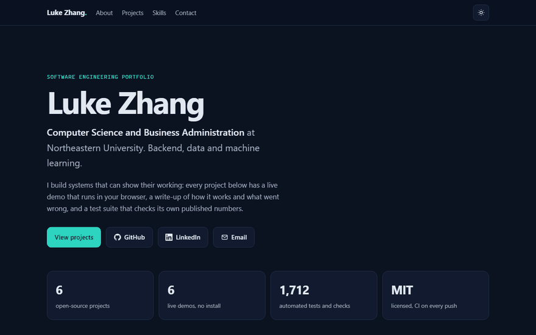

# Luke Zhang — Software Engineering Portfolio

[](https://github.com/luke-zhang-cs-py/luke-zhang-cs-py.github.io/actions/workflows/checks.yml)
[](https://luke-zhang-cs-py.github.io/)
[](index.html)

Eight projects in one place, each with a live demo that runs in your browser, what it does, what was measured,
and links to its write-up and source. One is told as a case study (problem, approach, result); the rest sit in a
grid you can filter by category. Press <kbd>Ctrl</kbd> <kbd>K</kbd> or <kbd>/</kbd> on the site to jump anywhere.

### ▶ [Open the portfolio →](https://luke-zhang-cs-py.github.io/)



*Above: the live site in dark mode, top to bottom. Each project's own demo plays inside its card as
the cards ease in. Recorded from the published page by [`tools/record_demo.py`](tools/record_demo.py).*

If `github.io` is blocked on your network (some university wifi is), open [`index.html`](index.html) locally instead.

## The projects

| Project | What it is | Demo | Source |
|---|---|---|---|
| **Toronto Transit Reach** | Isochrone map and trip planner over the TTC's timetable and live feed | [live](https://luke-zhang-cs-py.github.io/Toronto-Transit-Distance-Matrix/app/) | [repo](https://github.com/luke-zhang-cs-py/Toronto-Transit-Distance-Matrix) |
| **Almanac** | Calendar and multi-role booking platform, Flask + JWT | [live](https://luke-zhang-cs-py.github.io/Almanac-Main-Full-Stack-Calendar/app/) | [repo](https://github.com/luke-zhang-cs-py/Almanac-Main-Full-Stack-Calendar) |
| **Dvoretsky Lab** | Chess coach with its own engine, built from a player's games | [live](https://luke-zhang-cs-py.github.io/Dvoerstky-AI-Chess-Coach/) | [repo](https://github.com/luke-zhang-cs-py/Dvoerstky-AI-Chess-Coach) |
| **IPO Bot** | Research agent on Claude whose memos end in numbers code can check | [live](https://luke-zhang-cs-py.github.io/ipo-bot/app/) | [repo](https://github.com/luke-zhang-cs-py/ipo-bot) |
| **Face Recognition Attendance** | Local OpenCV attendance, benchmarked for fairness on 97,698 faces | [live](https://luke-zhang-cs-py.github.io/Facial-Recognition-Software/camera/) | [repo](https://github.com/luke-zhang-cs-py/Facial-Recognition-Software) |
| **AI Spam Classifier** | TF-IDF classifier that shows which words drove each verdict | [live](https://luke-zhang-cs-py.github.io/AI-Spam-Message-Classifier/app/) | [repo](https://github.com/luke-zhang-cs-py/AI-Spam-Message-Classifier) |
| **Wallet FX** | Euro spending in CAD and USD at each purchase day's ECB rate, and what the card's markup cost | [live](https://luke-zhang-cs-py.github.io/Budgeting-EU-US-CAN-Almanac-Branch/app/) | [repo](https://github.com/luke-zhang-cs-py/Budgeting-EU-US-CAN-Almanac-Branch) |
| **Tally** | Phone-first expense capture in two taps | [live](https://luke-zhang-cs-py.github.io/tally/app/) | [repo](https://github.com/luke-zhang-cs-py/tally) |

## Run it

Double-click `index.html`. It's one file of plain HTML, CSS and JavaScript: no build, no framework, no web fonts.

## Change the content

Everything the page shows lives in four arrays at the top of the script in `index.html`: `PROFILE`, `PROJECTS`,
`SKILLS`, and the command list built from them. Edit those, not the markup; the sections are rendered from them, the
filter chips from the projects' categories, and the headline test total is added up from each project's own count.

## Checks

```bash
pip install -r requirements.txt && python -m playwright install chromium
python tests/check_site.py        # 49 checks in a real browser (--offline skips the 3 that need the network)
python tests/check_site.py --coverage coverage.html   # plus which lines of JS and CSS rules ran
python tools/record_demo.py       # re-record docs/demo.gif from the live site
python tools/make_og.py           # re-render og.png, the link-preview image
```

`check_site.py` covers:
- every section and project link;
- that all eight demo GIFs load at their declared sizes;
- layout at 1280, 820, 390 and 360 px;
- dark mode and that it's remembered;
- reduced motion;
- the link-preview tags;
- the nav following the scroll and the links clicked;
- the featured case study, the category filter, the command palette by keyboard, and the contact form;
- WCAG AA contrast for every piece of text, in dark and light;
- print;
- that the figures on the page add up, and each appears in its project's own README;
- that the W3C validator finds no errors;
- that every outbound link answers.

It also guards privacy: it fails if the phone number from the resume appears anywhere in the site. The number itself is stored only as a hash.

## Layout

```
index.html      the whole site
404.html        GitHub Pages' not-found page
og.png          1200×630 link preview (from tools/og.html)
favicon.svg
docs/demo.gif   the recording above
tests/          the browser check
tools/          the demo recorder and the preview renderer
```
